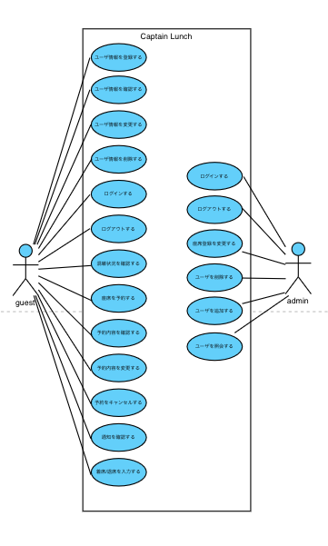

# 神戸大学 食堂 座席予約システム"キャプテン・ランチ" ユースケースモデリング

- 大規模ソフトウェア論 第 3 回
- 座席予約システム"キャプテン・ランチ"のユースケースモデリングを行う

## 1. ユースケース図

## 2. ユースケース一覧

### 食堂の利用客

- (作成中)

- 1. [ユーザ登録](./usecase_user_register.md)
- 2. [ユーザ情報の確認](./usecase_user_inform.md)
- 3. [ユーザ情報の更新](./usecase_user_update.md)
- 4. [ユーザ退会](./usecase_user_unsubscribe.md)
- 5. [ログイン](./usecase_user_login.md)
- 6. [ログアウト](./usecase_user_logout.md)
- 7. [混雑状況確認](./usecase_user_congestion.md)
- 8. [座席の予約](./usecase_user_reservation.md)
- 9. [予約の確認](./usecase_user_confirm_reservation.md)
- 10. [予約の変更](./usecase_user_update_reservation.md)
- 11. [予約のキャンセル](./usecase_user_cancel_reservation.md)
- 12. [通知を確認する]()
- 13. [着席・退席を入力]()

### 管理者

- (作成中)

- 21. [ログイン](./usecase_admin_login.md)
- 22. [ログアウト](./usecase_admin_logout.md)
- 23. [座席の変更](./usecase_admin_arrange_chairs.md)
- 24. [全ユーザの削除](./usecase_admin_deleteuser.md)
- 25. [全ユーザの追加](./usecase_admin_add_anyuser.md)
- 26. [全ユーザの照会]()
