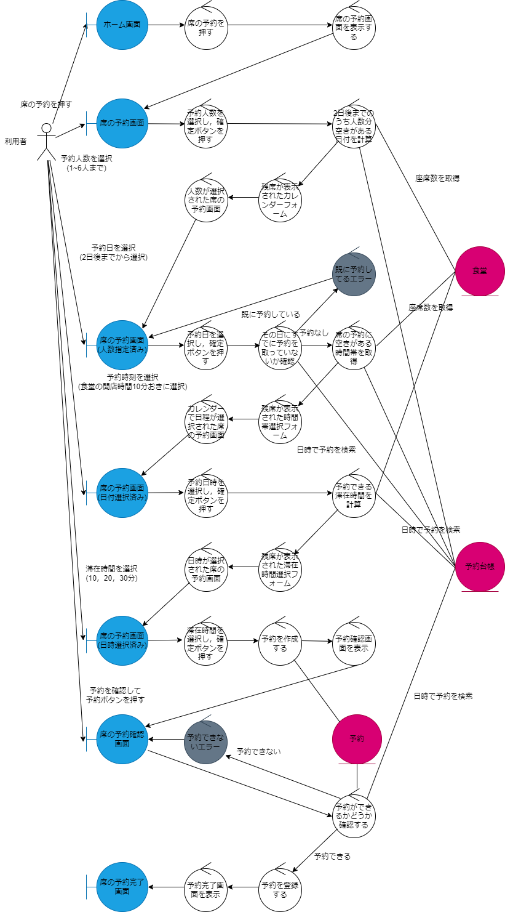
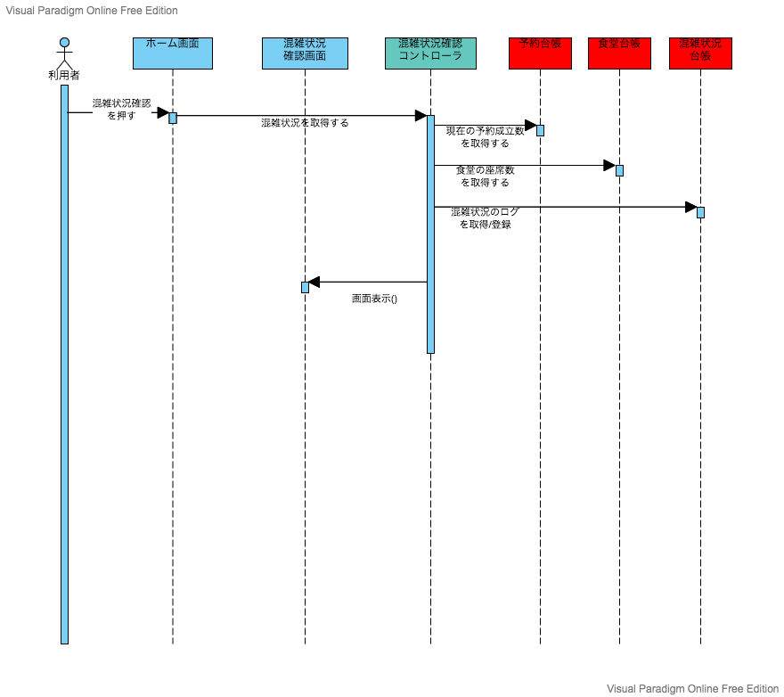

# 神戸大学 食堂 座席予約システム"キャプテン・ランチ" オブジェクト指向分析

## 1. [モノ・コトを発見する](./domain_modeling.pptx)

## 2. 仕事を発見する

### ユースケース図

### 7. 混雑状況確認

- [ユースケース記述](../usecase/usecase_user_congestion.md)

### 8. 座席の予約

- [ユースケース記述](../usecase/usecase_user_reservation.md)

### 12. 通知を確認する

- [ユースケース記述](../usecase/usecase_user_notification.md)

## 3. 仕事を割り当てる

### 7. 混雑状況確認

### 8. 座席の予約

### 12. 通知を確認する

## その他

- [全体のドメインモデリング図の編集 URL](https://online.visual-paradigm.com/community/share/domainmodel-user-reservation-vpd-10c1utlb43)
