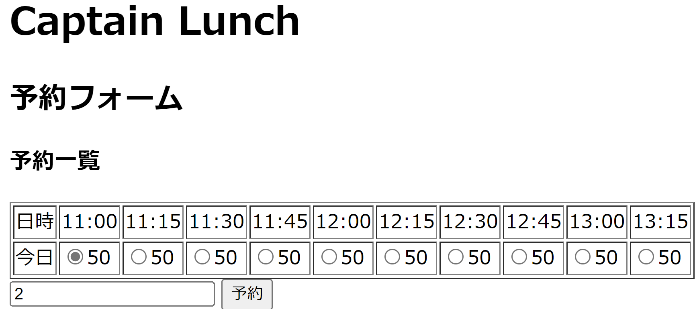
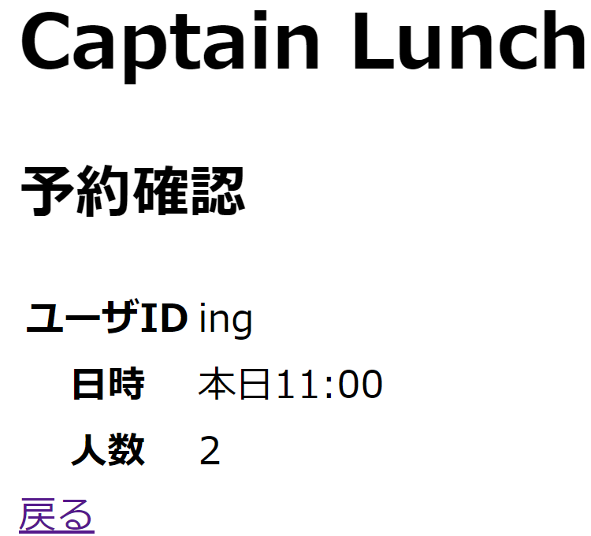

# 神戸大学 食堂 座席予約システム"キャプテン・ランチ" 実装
2022-08-01 長谷

## 概要

- [神戸大学 食堂 座席予約システム"キャプテン・ランチ"](../README.md)の参照実装
- 利用技術
  - サーバ側 : Spring Boot 2.6.10

- [19個のユースケース](../usecase/README.md)のうち1個を実装
  - [ユースケース 8：座席を予約する](../usecase/usecase_user_reservation.md)

## 実装上の妥協
- カレンダーフォームではなく，表から決められた時間帯を予約する形式にした
- 利用人数の制限なし
  - なんなら負の数の人数で予約できる

- 予約できるのは当日の座席のみ
- 空きがない座席も予約できる
- 1ユーザが何回でも予約できる
- つまりは，予約ができる仕組みを作成したが，バリデーションなどは行っていない
- 特にDate型の扱いに関して杜撰な部分が多い

## 実行方法

1. MySQLに新規データベースcaptainlunchを作成
    - ユーザ： captain　パスワード：cpassword に全権委譲 (grant all) すること
1. MySQLを起動
1. VS-CodeでCaptainLunchApplication.java をF5で実行
    - もしくはターミナルでgredlewがあるパスで ./gradlew bootrun を実行
1. http://localhost:2290/<任意のユーザ名>/reservation を開く
1. 任意の時間帯と利用人数を入力して座席を予約してみる

## デプロイ方法 あとで記述

1. VS-Codeでctrl-@ でパワーシェルを起動
1. .\gradlew.bat war でwarを作成 (/build/libs/captain-lunch.war) ができる
1. captain-lunch.war を Tomcatのwebappsにwarコピー
1. http://localhost:8080/captain-lunch/<任意のユーザ名>/reservation にアクセス

## 画面
### 座席の予約画面

- 時間帯と利用人数を入力して，予約を押す

### 座席の予約完了画面

