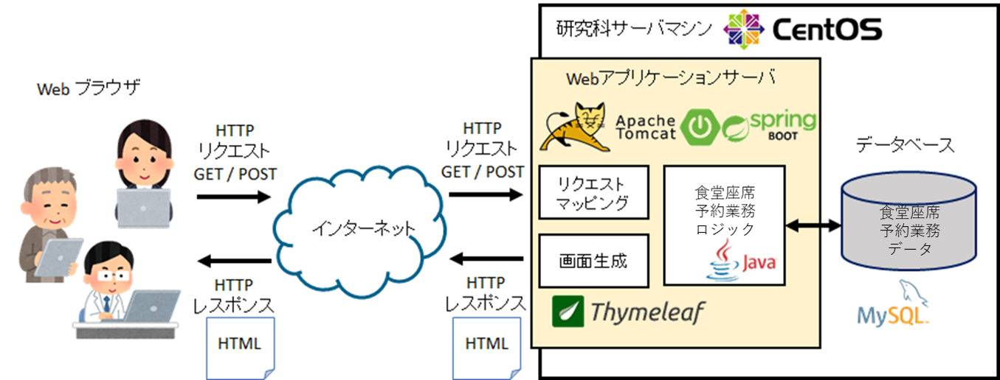
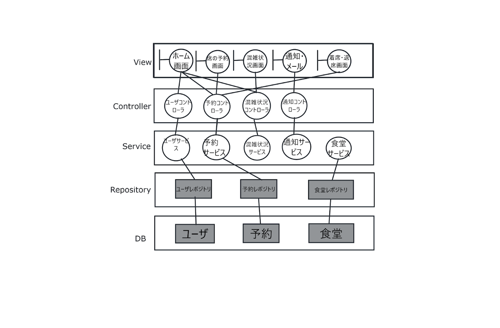
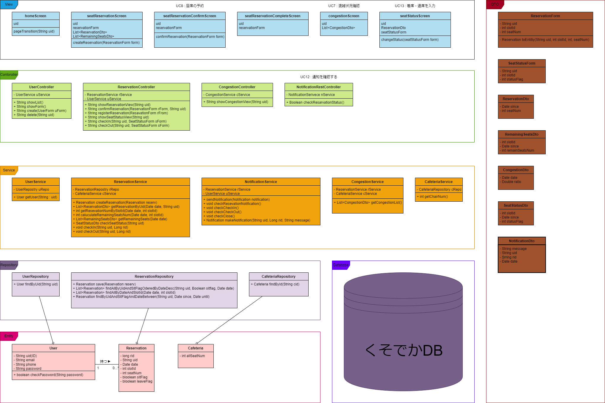

# 神戸大学 食堂 座席予約システム"キャプテン・ランチ" : オブジェクト指向設計

## システム・アーキテクチャ

### 神戸大学 食堂 座席予約システム"キャプテン・ランチ"のシステムアーキテクチャを下に示す．

[要求仕様書](../requirement/README.md) から Web アプリケーションとして実現することが求められているため，以下の設計選択を行った．

- 研究科に新しくサーバマシンを設置し，Linux (CentOS)をインストール
- サーバマシン上に Apache Tomcat Web アプリケーションサーバと，MySQL データベースサーバをインストール
- 食堂座席予約システムの業務ロジックは Java で実装する
- 業務データは MySQL に保存・管理する
- Tomcat と Java の連携は，Spring Boot フレームワークで行う
- 画面についてはテンプレートエンジン Thymeleaf を使い，サーバ内で HTML を動的生成する

## ソフトウェア・アーキテクチャ

ソフトウェア・アーキテクチャについては，下図の通り 4 層アーキテクチャを採用する．

なお，データの永続化は，RDB で行う

## 設計レベルのクラス図

[ドメインモデル図](../anarysis/img/domainmodel_user_all.vpd.png)を基に，設計レベルのクラス図を作成した．

