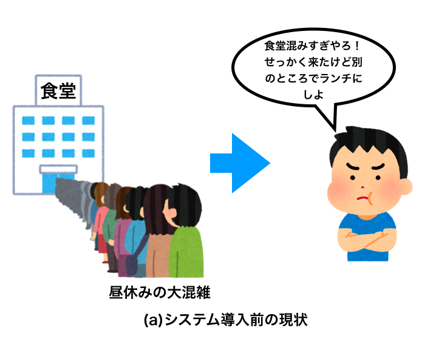
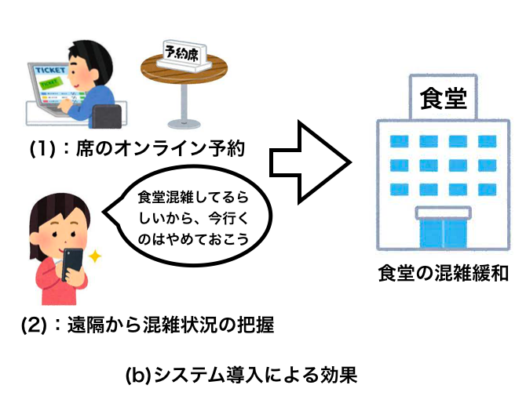

# 神戸大学 食堂 座席予約システム"キャプテン・ランチ" 要求仕様

## 1. システムの目的

- 本システムの目的は，神戸大学内で大学生協が運営している**食堂の座席を予約制**にしたうえで，**その予約を Web アプリケーション化**し，食堂の利用者が場所や時間を選ばずに，オンデマンド・セルフサービスで，食堂の座席を予約可能にすることである．また，**座席の混雑状況**を可視化するとで，利用者が無駄に混雑している食堂に無駄に向かわないようにすることも目的に含まれる．

- これまで，神戸大学の食堂では，自由に座席を指定するフードコートのような形態をとっていた．具体的には，窓口でメニューを購入し，空いている座席を選んで座るといったシステムである．しかし，**昼休みの時間には，座席が混雑し，食堂前に大規模な列ができてしまうこと**や，それによって食堂に向かっても，**すぐにご飯にありつけない**等の課題があった．

- そこで，食堂の座席を完全または，一部**予約制**にし，その**予約システムを Web アプリケーション**として実装する．そのアプリケーションによって，食堂の利用者が主にスマートフォンから 24 時間 365 日，どこからでも，食堂の座席を予約，確認，変更，キャンセルできるようにする．また，**座席状況を管理して，可視化する．** 本システムの導入によって，**食堂が混雑する時間帯の混雑が軽減され**，行列ができない状況が達成され，食堂の運営側は，客足の把握がしやすくなる．さらに，利用者側も，**混雑している食堂に無駄に足を運ばなくてよく**，予約さえしていれば，**すぐに料理にありつける**．

## 2. システムの概要

- 本システムは，**食堂の座席を完全または，一部予約制にし，その予約システムを Web アプリケーションとして構築する．**
- 下図(a)は，システム導入前の現状である．食堂は座席を自由に指定するシステムで，昼食の時間に利用者の利用が重複し，**食堂前に長蛇の列ができる．**また，食堂を利用としても列のせいで**すぐには料理にありつけないため，食堂の利用を諦めるケースもあり，非効率である．**

- 下図(b)は，システム導入後のあるべき姿である．食堂の座席予約システム"キャプテン・ランチ"では，食堂の利用者，座席，座席予約のデータをシステム内で管理する Web アプリケーションとして実装される．食堂の利用者は，自身の PC やスマホで Web ブラウザを開き，システムにログインして，食堂の座席の予約管理を行う．システムは，現状の予約状況を一覧するカレンダー機能，予約を登録・変更・キャンセルをする予約管理機能，座席の混雑状況可視化機能，予約時間が近づいてきたら通知および，予約時間が過ぎても着席が確認できなかったら後回しにすることを通知する機能，予約した座席に着席・退席したことを入力する機能を持つ．

- システムの導入によって，食堂の座席が簡単に予約できるようになり，予約によって座席を管理することで，待ち行列の肥大化が防がれる．また，利用者が混雑状況をサービスから知れることで，混雑している食堂に無駄に足を運ばなくて済む．

## 3. 機能一覧

- (1)管理者機能
  - 座席数の管理[追加、削除、変更]を行うことができる機能。また悪意のあるユーザの削除、変更を行うことが可能。予約可能時間の設定も可能。
- (2)ユーザ登録・管理機能
  - 座席を予約するためのユーザの登録を行うことができる機能。また自身の情報の変更・削除を行うことができる。ユーザはユニークな ID、パスワード、メールアドレス、電話番号の登録を行う。
- (3)混雑管理機能
  - 食堂の混雑状況を取得し、サービスの画面にて周知する機能。
- (5)ログイン機能
  - ユーザのログインを行うことができる機能。ログインはユーザ ID とパスワードを入力することで行う。ログインが成功すると予約状況カレンダーの確認・予約の登録・自身の予約の変更・キャンセルが可能になる。
- (6)予約管理機能
  - 予約状況を確認することができる機能。ログインに成功した者予約の作成、変更、キャンセルが可能になる。予約の作成には使用日、開始時間の選択により行う。予約の変更は開始時間のみ可能。予約のキャンセルは指定した予約を削除する。
- (7)通知機能
  - 予約時間に近づくと、登録されたメールアドレスに通知する機能。
- (8)着席・退席入力機能
  - Web にて予約された時間・座席に着席・または退席することができる機能。web 上に配置されたボタンを押すことで着席・退席を行う。予約時間に利用者が来なかったときに後回しにすることも行う。
- (9)カレンダー機能
  - 予約状況を確認するためのカレンダーを表示することができる機能。予約フォームとして機能する。
