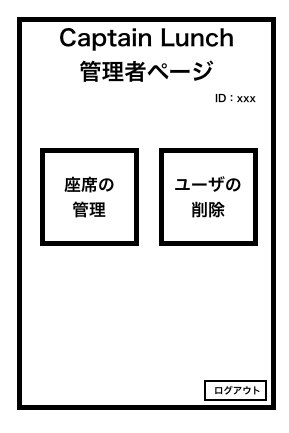

# ユースケース 2： ログアウトする

## 概要

システム管理者がシステムにログインして予定管理業務を行う権限を取得する

## アクター

- システム管理者

## 事前条件

- システムにログインしていること

## 事後条件

- システム管理者がシステムにログアウトした状態になる

## トリガ―

- システム管理者がシステムの任意の画面において「ログアウト」リンクを押す

## 基本フロー

1. 教員は、画面上のログアウトリンクを押す
2. システムは、ログイン画面を表示する

## 代替フロー

なし

## GUI 紙芝居

### 管理者のホーム画面

