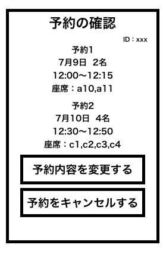
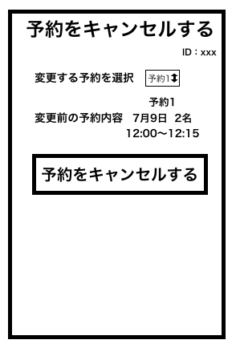

# ユースケース 11：座席の予約をキャンセルする

## 概要

利用者が座席の予約確認画面において，座席の予約をキャンセルする

## アクター

- 食堂の利用客

## 事前条件

- 利用者がシステムにログインしていて，座席の予約確認画面を開いていること

## 事後条件

- 利用者がキャンセルしたい座席のや予約がキャンセルされている
- システムは座席の予約確認画面をを表示する

## トリガ―

- 利用者が座席の予約確認画面で予約をキャンセルするを押す

## 基本フロー

1. 利用者は座席の予約確認画面から「予約をキャンセルする」ボタンを押す
2. システムはログインしている利用者を ID で 座席の予約情報 DB から検索し，座席の予約キャンセルフォームを表示する
3. 利用者はキャンセルしたい予約番号を選択し，「キャンセル」ボタンを押す
4. システムは，該当する予約 ID を座席の予約情報 DB から検索し，問題なければ，座席の予約のキャンセル確認画面を表示する
5. 利用者はキャンセル確認画面を確認し，「キャンセル」ボタンを押す
6. システムは，該当する予約情報を座席の予約情報 DB から削除し，座席の予約確認画面を表示する

## 代替フロー

- 2a-1. 該当ユーザの座席の予約が見つからない場合，座席の予約無エラーを表示する

## GUI 紙芝居

### 予約の確認画面

### 座席の予約キャンセル画面

- コメント : キャンセルの確認画面があった方がいい
