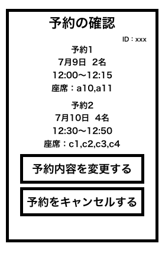

# ユースケース 9： 席の予約情報を確認する

## 概要

利用者が席の予約情報の確認画面において，予約情報を確認する

## アクター

- 食堂の利用客

## 事前条件

- 利用者がシステムにログインしていること

## 事後条件

- システムが該当利用客の予約情報を表示する

## トリガ―

- 利用者がホーム画面で予約の確認を押す

## 基本フロー

1. 利用者はホーム画面から「予約の確認」ボタンを押す
2. システムはログインしている利用者を ID で席の予約情報 DB から検索し，画面に席の予約情報(予約番号，予約日時，予約人数，予約時刻)を表示

## 代替フロー

- 2a.1 利用者の予約がなければ，予約情報を表示しない

## GUI 紙芝居

### ホーム画面

### 予約の確認画面

