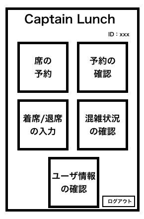
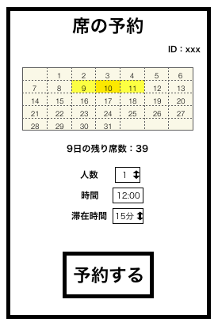

# ユースケース 8：座席を予約する

## 概要

利用者が座席予約画面において，食堂の座席を予約する

## アクター

- 食堂の利用者

## 事前条件

- 利用者がシステムにログインしていること
- 予約しようとしている日にまだ予約をしていないこと

## 事後条件

- システムが該当利用者が指定した日時，時間，席の個数の情報に合う予約がとれていること

## トリガ―

- 利用者がメニュー画面から席の予約を押す

## 基本フロー

1. 利用者が，ある年月日のホーム画面で「席の予約」ボタンを押す
2. システムは，3 日後までを選択できるカレンダーを含む予約フォームを表示する
3. 利用者は予約人数を 1~6 人から選択して，「確定する」ボタンを押す
4. システムは，2 日後までのうち人数分空きがある日付を計算し，残席が表示されたカレンダーフォームを含み，予約人数が確定された予約画面を表示する
5. 利用者は，カレンダーで 2 日後までの中から選択できる日付を選択し，「確定する」ボタンを押す
6. システムは，該当する利用者がその日に既に予約を取っていないかをチェックする，問題なければ次に進む
7. システムは，入力された日付のうち，人数分空きがある時間帯を計算し，残席が表示され，予約人数，予約日が確定された予約画面を表示する
8. 利用者は，選択できる予約時刻(食堂の開店時刻から 10 分置き)の中から選択できる日付を選択し，「確定する」ボタンを押す
9. システムは，入力された予約時刻から，人数分空きがある滞在時間を計算し，残席が表示され，予約人数，予約日，予約時刻が確定された予約画面を表示する
10. 利用者は，選択できる滞在時間(10，20，30 分)の中から選択できる日滞在時間を選択し，「確定する」ボタンを押す
11. システムは，入力された情報に基づき，予約を作成し，予約確認画面を表示する
12. 利用者は確認ができたら「予約する」ボタンを押す
13. システムは，作成した予約が取れるかをチェックし，問題なければ，予約を登録し，予約完了画面を表示する

## 代替フロー

### 代替フロー 1

- 6a.1 基本フロー 6 において，席の空きがない場合は，既に予約済エラーを表示し，4 に戻る

### 代替フロー 2

- 13a.1 基本フロー 13 において，予約が取れない場合は，空席なしエラーを表示し，9 に戻る

## GUI 紙芝居

### ホーム画面

### 席の予約画面

コメント：カレンダー，人数，時間，滞在時間を選択肢にすることでエラーを未然に防げる

コメント : 席の予約確認画面があった方が良い
