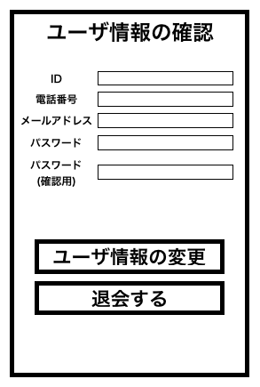

# ユースケース 4： ユーザのアカウントを削除する

## 概要

利用者がユーザ情報の確認画面において，アカウントを削除する

## アクター

- 食堂の利用客

## 事前条件

- 利用者がシステムにログインしていて，ユーザ情報の確認画面を開いていること

## 事後条件

- 利用者のアカウントが削除されている
- システムはログイン画面を表示する

## トリガ―

- 利用者がユーザ情報の確認画面で退会を押す

## 基本フロー

1. 利用者はユーザ情報の確認画面から「退会」ボタンを押す
2. システムはログインしている利用者を ID で アカウント情報 DB から検索し，退会確認画面を表示する
3. 利用者は退会画面を確認し，「退会」ボタンを押す
4. システムは，ログイン画面を表示する

## 代替フロー

- なし

## GUI 紙芝居

### ユーザ情報の確認画面

- コメント : 退会の確認画面があった方がいい
