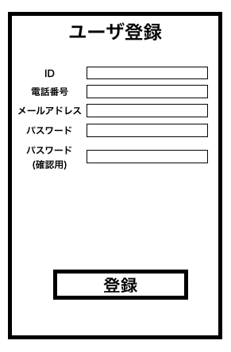

# ユースケース 4： 任意のユーザの追加

このユースケースは必要ないかも？

## 概要

システム管理者が任意のユーザを追加する

## アクター

- システム管理者

## 事前条件

- システム管理者がシステムにログインした状態であること
- メニュー画面から「ユーザの変更」を選択し、その画面に遷移した状態であること

## 事後条件

- 新たなユーザがシステムに追加された状態になる

## トリガ―

- システム管理者がメニュー画面から「ユーザの変更」を選択ボタンを押し、その先の遷移画面で「ユーザの追加」ボタンを押す

## 基本フロー

1. システム管理者がメニュー画面から「ユーザの変更」を選択する
2. システムが、ユーザの変更画面を表示する
3. システム管理者が、「ユーザの追加」ボタンを押す
4. システムが、ユーザの追加画面を表示する
5. システム管理者は、ユーザの追加画面にて、ユーザIDとパスワード、メールアドレス、電話番号を入力して「登録」ボタンを押す
6. システムは、IDと電話番号の一意性を確認し、問題なければ、アカウントの登録画面確認を表示する
7. システム管理者は登録内容を確認し、「登録」ボタンを押す
8. システムは新しいユーザの情報をアカウント DB に登録する

## 代替フロー

### 代替フロー1

- 6.a.1  基本フロー6において、一意性が確認されなかった場合や、問題があった場合、4に戻す。

## GUI紙芝居

### ユーザ登録画面

