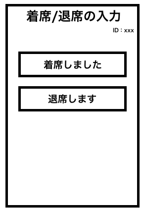

# ユースケース X： ユーザの状態(着席・離席)の入力

## 概要

利用者が状態入力画面にて、現在の状態(着席・離席)の入力を行う

## アクター

- 食堂の利用客

## 事前条件

- 利用者がシステムにログインしていて，状態入力画面を開いていること

## 事後条件

- システムは該当ユーザの、DBの状態を更新する

## トリガ―

- 利用者が状態入力画面で「着席」または「離席」ボタンを押す

## 基本フロー

1. 利用者は状態入力画面から「着席」または「離席」ボタンを押す
2. システムは確認画面を表示する
3. 利用者は確認画面にて更新する状態を確認し，「確認」ボタンを押す
4. システムはDBにある、該当ユーザの状態を更新する

## 代替フロー

なし

## GUI 紙芝居

### 状態入力画面

