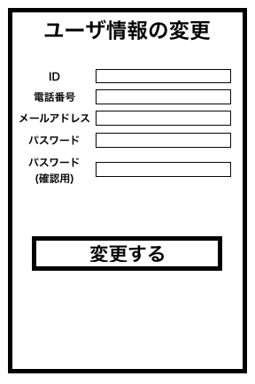

# ユースケース： ユーザ情報を更新する

## 概要

利用者がユーザ情報の確認画面においてアカウント情報を更新する

## アクター

- 食堂の利用者

## 事前条件

- 利用者がシステムにログインしていて，ユーザ情報の確認画面を開いていること

## 事後条件

- 利用者のアカウント情報が更新される
- 更新されたアカウント情報の確認画面が表示される

## トリガ―

- 利用者がユーザ情報の確認画面でユーザ情報の更新を押す

## 基本フロー

1. 利用者はユーザ情報の確認画面から「ユーザ情報の変更」ボタンを押す
2. システムはログインしている利用者を ID で DB から検索し，画面にアカウント情報(ID，パスワード，メールアドレス，電話番号)が示されているユーザ情報更新フォームを表示する
3. 利用者はフォームの パスワード，メールアドレス，電話番号を書き変えて「変更する」ボタンを押す
4. システムは電話番号の一意性を確認し，問題なければ，アカウントの更新確認画面を表示する
5. 利用者は更新内容を確認し，「変更する」ボタンを押す
6. システムは利用者の入力内容をアカウント DB に登録する

## 代替フロー

### 代替フロー 1

- 4a-1. 基本フロー 3 で利用者が存在する電話番号を入力した場合，電話番号既存のエラーを表示し，2 に戻る

## GUI 紙芝居

### ユーザ情報の更新画面

コメント：変更の確認画面があった方が良い
