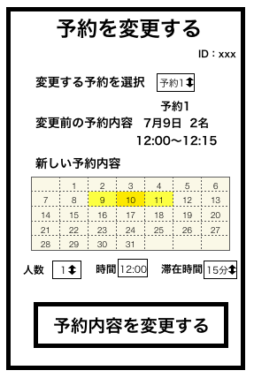

# ユースケース： 座席の予約情報を更新する

## 概要

利用者が座席の予約情報の確認画面において座席の予約を更新する

## アクター

- 食堂の利用者

## 事前条件

- 利用者がシステムにログインしていて，予約の確認画面を開いていること

## 事後条件

- 利用者の座席の予約情報が更新される
- 更新された予約の確認画面が表示される

## トリガ―

- 利用者が予約の確認画面で予約内容の変更を押す

## 基本フロー

1. 利用者は予約の確認画面から「予約内容の変更」ボタンを押す
2. システムはログインしている利用者の ID で 席の予約情報 DB から検索し，画面に変更前の席の予約情報(予約番号，予約日時，予約人数，予約時刻)を表示するとともに，予約情報更新フォームを表示する
3. 利用者はフォームの 予約番号を指定して，カレンダーで 3 日後までの中から日付を選択し，人数，時間，または滞在時間を書き変えて「予約内容を変更する」ボタンを押す
4. システムは入力された時間帯に席の空きがあるかと，該当する利用者がその日に既に予約を取っていないかをチェックし，問題なければ，予約情報の更新確認画面を表示する
5. 利用者は更新内容を確認し，「予約内容を変更する」ボタンを押す
6. システムは利用者の入力内容を席の予約情報 DB に登録する

## 代替フロー

### 代替フロー 1

- 4a.1 基本フロー 4 において，席の空きがない場合は，空席なしエラーを表示し，2 に戻る

### 代替フロー 2

- 4b.1 基本フロー 4 において，該当する利用者がその日に既に予約をしている場合は，該当日の予約済みエラーを表示し，2 に戻る

## GUI 紙芝居

### ユーザ情報の更新画面

コメント：予約の変更で日時は変えられないようにした方がエラーを出しやすそう
